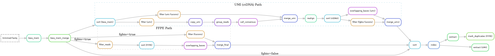

# Alignment
See the [alignment hydra-genetics module](https://hydra-genetics-alignment.readthedocs.io/en/latest/) documentation for more details on the softwares. Default hydra-genetics settings/resources are used if no configuration is specified.

<br />
{: style="height:90%;width:90%"}

## Pipeline output files:

* `bam_dna/{sample}_{type}.bam`
* `bam_dna/{sample}_{type}.bam.bai`
* `bam_dna/{sample}_{type}.umi.bam` (ctDNA only)
* `bam_dna/{sample}_{type}.umi.bam.bai` (ctDNA only)

## Alignment (FFPE)
Alignment of fastq files into bam files is performed by **[bwa-mem](https://github.com/lh3/bwa)** v0.7.17 using the non-merged trimmed fastq files. This make it possible to speed up alignent by utlizing parallization and also make it possible to analyze qc for lanes separately.

For FFPE samples, an optional overlapping consensus step can be performed using **[fgbio CallOverlappingConsensusBases](http://fulcrumgenomics.github.io/fgbio/tools/latest/CallOverlappingConsensusBases.html)**. This step identifies and corrects bases in overlapping read pairs where the bases disagree, followed by filtering and sorting.

This behavior is controlled by the following configuration:

| **Option** | **Default** | **Description** |
|------------|-------------|-----------------|
| `run_ffpe_overlapping_consensus` | `true` | If `true`, runs the FGBIO overlapping consensus path. If `false`, bypasses these steps and uses BWA-MEM output directly. |

If bypassed, bamfiles are then directly sorted by **[samtools sort](http://www.htslib.org/doc/samtools-sort.html)** v1.15.

## Alignment (ctDNA)
Alignment of ctDNA samples is performed using **[bwa-mem](https://github.com/lh3/bwa)** v0.7.17. To handle UMI (Unique Molecular Identifier) tags, the reads are processed to consensus reads to correct for PCR and sequencing errors. This is done using **[fgbio](http://fulcrumgenomics.github.io/fgbio/)**.

The UMI processing involves the following steps:
1.  **Copy UMI**: Copies the UMI at the end of the BAM’s read name to the RX tag using `fgbio CopyUmiFromReadName`.
2.  **Group Reads**: Group and sort reads based on UMI using `fgbio GroupReadsByUmi`.
3.  **Call Consensus**: Call and filter consensus reads based on UMIs using `fgbio CallDuplexConsensusReads` followed by `fgbio FilterConsensusReads`.
4.  **Realign**: Realign consensus reads using **[bwa-mem](https://github.com/lh3/bwa)**.
5.  **Overlapping Consensus**: Identify and correct bases in overlapping read pairs using `fgbio CallOverlappingConsensusBases`.

### Read groups
Bam file read groups are set according to sequencing information in the `units.tsv` file.
The @RG read tag is set using the following options defined in the hydra-genetics bwa rule:
```
-R '@RG\tID:{ID}\tSM:{SM}\tPL:{PL}\tPU:{PU}\tLB:{LB}' -v 1
```
where the individual read groups are defined below:

| **RG tag** | **Value** |
|-------------|-|
| ID | sample_type.lane.barcode |
| SM | sample_type |
| PL | platform |
| PU | flowcell.lane.barcode |
| LB | sample_type |


### Configuration

**Reference files**  

- [bwa reference genome indexes](references.md#bwa_me_ref)

<br />
**Software settings**

| **Options** | **Value** | **Description** |
|-------------|-|-|
| sorting | samtools | use samtools to sort the bam files |
| sort_order | coordinate | use coordinate sorting |
| sort_extra | -@ 10 | use 10 threads for sorting |  

<br />
**Cluster resources**

| **Options** | **Value** |
|-------------|-|
| mem_mb | 61440 |
| mem_per_cpu | 6144 |
| threads | 10 |
| time | "8:00:00" |

## Bam splitting
The bam files are split into chromosome files for faster performance in downstream analysis. Split files are used by markduplicates and SNV/INDEL calling. Splitting is performed by **[samtools view](http://www.htslib.org/doc/samtools-view.html)** v1.15.

## Mark duplicates
Flagging duplicated reads are performed on individual chromosome bam files by **[picard MarkDuplicates](https://broadinstitute.github.io/picard/command-line-overview.html#MarkDuplicates)** v2.25.0.

## Merging
Merging of deduplicated bam files belonging to the same sample are performed by **[samtools merge](http://www.htslib.org/doc/samtools-merge.html)** v1.15.

### Configuration

**Software settings**

| **Options** | **Value** | **Description** |
|-------------|-|-|
| extra | -c | emit only one identical @RG headers |
| extra | -p | use the @PG ID of the first file |

## Sorting
Merged bamfile are sorted by **[samtools sort](http://www.htslib.org/doc/samtools-sort.html)** v1.15.

## Bam indexing
Bamfile indexing is performed by **[samtools index](http://www.htslib.org/doc/samtools-index.html)** v1.15.

<br />
