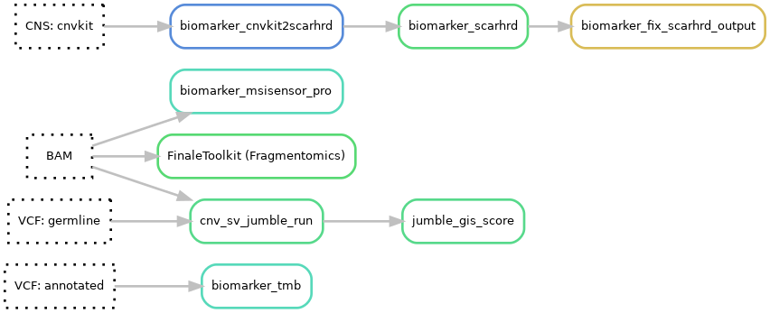

# Biomarkers
See the [biomarkers hydra-genetics module](https://hydra-genetics-biomarker.readthedocs.io/en/latest/) documentation for more details on the softwares for the respective biomarkers. Default hydra-genetics settings/resources are used if no configuration is specified.

 
{: style="height:50%;width:50%"}

## Pipeline output files:

* `results/dna/{sample}_{type}/tmb/{sample}_{type}.TMB.txt`
* `results/dna/{sample}_{type}/msi/{sample}_{type}.msisensor_pro.score.tsv`
* `results/dna/{sample}_{type}/hrd/{sample}_{type}.purecn.scarhrd_cnvkit_score.txt`
* `results/dna/{sample}_{type}/hrd/{sample}_{type}.pathology.scarhrd_cnvkit_score.txt`

## Tumor mutational burden (TMB)
TMB is a measure of the frequency of somatic mutations and is usually measured as mutations per megabase. The size of design of the exons is approximately 1.55Mb. However, by validating the TMB for GMS560 against Foundation One and TSO500 TMB the effective design size is adjusted to 1.19Mb. This is based on the slope (0.84) of the correlation between TSO500 data and the number of variants in the TMB analysis. The TMB is calculated using the in-house script **[tmb.py](https://github.com/hydra-genetics/biomarker/blob/develop/workflow/scripts/tmb.py)** ([rule](https://github.com/hydra-genetics/biomarker/blob/develop/workflow/rules/tmb.smk)) which counts the number of nsSNVs and divide by the adjusted design size. Variants must fulfill the following criteria to be counted:

### Configuration
**Software settings**

| **Options** | **Value** | **Description** |
|-|-|-|
| af_lower_limit | 0.05 | Minimum 5% allele frequency |
| af_upper_limit | 0.95 | Maximum 95% allele frequency |
| af_germline_lower_limit | 0.47 | Filter out probable germline SNPs with allele frequency between 47%-53% |
| af_germline_upper_limit | 0.53 | Filter out probable germline SNPs with allele frequency between 47%-53% |
| artifacts | " " | Do not use artifact panel of normal |
| background_panel | " " | Do not use background panel of normal |
| db1000g_limit | 0.0001 | Germline filter of 0.01% population frequency
| dp_limit | 100 | Minimum read depth of 100 |
| gnomad_limit | 0.0001 | Germline filter of 0.01% population frequency ||
| nssnv_tmb_correction | 0.84 | (Number of variants - nr_avg_germline_snvs) * correction factor (correction factor = 1 / adjusted design size) |
| nr_avg_germline_snvs | 2.0 | Correction based on the average number of germline variants passing all filters |
| vd_limit | 10 | Minimum 10 observations of variant allele |

The result is the TMB calculated using nsSNVs. However, the variants passing all filters are also provided.

### Result file

* `results/dna/{sample}_{type}/tmb/{sample}_{type}.TMB.txt`

## Microsatellite instability (MSI)
To determine MSS or MSI status of the samples the percentage of sites that have microsatellite instability are calculated using **[MSIsensor-pro](https://github.com/xjtu-omics/msisensor-pro)** v1.1.a. When more than 10% of the sites are instable the sample is determined to have MSI status. The program uses a panel of normal to determine the normal level of instability in the used sites.

### Configuration
**Reference**

* [Panel of normal](references.md#msisensor_pro_pon) for MSIsensor-pro (see [references](references.md) on how the PoN was created)

### Result file

* `results/dna/{sample}_{type}/msi/{sample}_{type}.msisensor_pro.score.tsv`

## Homologous recombination deficiency (HRD) - in development
**OBS! The Homologous recombination deficiency score is still under development**  
A homologous recombination deficiency score is calculated using **[scarHRD](https://github.com/sztup/scarHRD)** v20200825 using cnvkit segmentation files as input. The cnvkit panel of normal for HRD is created from a design file where the extra CNV-probes were removed as coverage in these regions tended to be more affected in low quality samples. The segmentation is sensitive to the estimated purity. Therefore, a score based on both the pathology and purecn estimated tumor content is reported. The cutoff for HRD is still to be determined but is somewhere around 50 which is slightly higher than the Myriad HRD score cutoff of 42.

### Configuration

**Reference for cnvkit**

* [Panel of normals](references.md#normal_reference_hrd) created by cnvkit with extra CNV-probes removed (see [references](references.md) on how the PoN was created)

**Software settings**

| **Options** | **Value** | **Description** |
|-|-|-|
| reference_name | "grch37" | Reference genome |
| seqz | FALSE | Do not use seqz |

### Result files

* `results/dna/{sample}_{type}/hrd/{sample}_{type}.purecn.scarhrd_cnvkit_score.txt`
* `results/dna/{sample}_{type}/hrd/{sample}_{type}.pathology.scarhrd_cnvkit_score.txt`

## Fragmentomics
Fragmentomics analysis is performed using **[FinaleToolkit](https://github.com/epigen/FinaleToolkit)**. It calculates various metrics related to cell-free DNA fragmentation patterns, which can be used as biomarkers.

### Result files

* `results/dna/{sample}_{type}/fragmentomics/{sample}_{type}.end-motifs.tsv`
* `results/dna/{sample}_{type}/fragmentomics/{sample}_{type}.mds.txt`
* `results/dna/{sample}_{type}/fragmentomics/{sample}_{type}.interval-end-motifs.tsv`
* `results/dna/{sample}_{type}/fragmentomics/{sample}_{type}.interval-mds.txt`
* `results/dna/{sample}_{type}/fragmentomics/{sample}_{type}.frag-length-bins.tsv`
* `results/dna/{sample}_{type}/fragmentomics/{sample}_{type}.fragment_length_score.txt`
