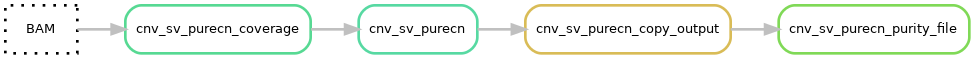
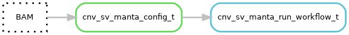
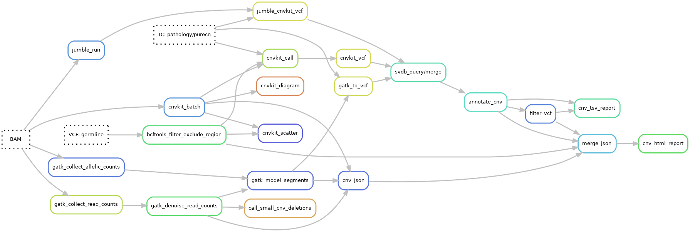

# CNV calling merging and purity estimation
See the [cnv hydra-genetics module](https://hydra-genetics-snv-indels.readthedocs.io/en/latest/) documentation for more details on the softwares for cnv calling. Default hydra-genetics settings/resources are used if no configuration is specified.

<br />
{: style="height:55%;width:55%"}
<br />
{: style="height:30%;width:30%"}

<br />
<br />


## Pipeline output files:

### Main output

* `results/dna/{sample}_{type}/cnv/{sample}_{type}.pathology_purecn.cnv.html`
* `results/dna/{sample}_{type}/cnv/{sample}_{type}.pathology_purecn.amp_all_del_validated.cnv_report.tsv`
* `results/dna/{sample}_{type}/cnv/{sample}_{type}.purecn_purity_ploidity.csv`

### Additional output
* `results/dna/{sample}_{type}/additional_files/cnv/{sample}_{type}.amplifications.tsv`
* `results/dna/{sample}_{type}/additional_files/cnv/{sample}_{type}.deletions.tsv`
* `results/dna/{sample}_{type}/additional_files/cnv/{sample}_{type}.cnvkit.diagram.pdf`
* `results/dna/{sample}_{type}/additional_files/cnv/{sample}_{type}.cnvkit.scatter.png`
* `results/dna/{sample}_{type}/additional_files/cnv/{sample}_{type}.manta_tumorSV.vcf.gz`
* `results/dna/{sample}_{type}/additional_files/cnv/{sample}_{type}.pathology.amp_all_del_all.cnv_report.tsv`
* `results/dna/{sample}_{type}/additional_files/cnv/{sample}_{type}.pathology.amp_all_del_validated.cnv_report.tsv`
* `results/dna/{sample}_{type}/additional_files/cnv/{sample}_{type}.pathology.cnv.html`
* `results/dna/{sample}_{type}/additional_files/cnv/{sample}_{type}.pathology_purecn.amp_all_del_all.cnv_report.tsv`
* `results/dna/{sample}_{type}/additional_files/cnv/{sample}_{type}.pathology_purecn.svdb_query.vcf`
* `results/dna/{sample}_{type}/additional_files/cnv/{sample}_{type}.pathology.svdb_query.vcf`
* `results/dna/{sample}_{type}/additional_files/cnv/{sample}_{type}.purecn.amp_all_del_all.cnv_report.tsv`
* `results/dna/{sample}_{type}/additional_files/cnv/{sample}_{type}.purecn.amp_all_del_validated.cnv_report.tsv`
* `results/dna/{sample}_{type}/additional_files/cnv/{sample}_{type}.purecn.cnv.html`
* `results/dna/{sample}_{type}/additional_files/cnv/{sample}_{type}.purecn.svdb_query.vcf`


## CNV calling
CNVs are called using CNVkit, GATK CNV, and Jumble followed by merging and annotation by SVDB and finally filtered and visualized into an html report. Additionally, smaller CNV deletions and amplifications are called in specific genes using an in-house script.

### CNVkit
CNV segmentation is performed by **[CNVkit](https://cnvkit.readthedocs.io/en/stable/)** v0.9.9 on BWA-mem aligned and merged bam-files. CNVkit uses a panel of normal (see [references](references.md) on how the PoN was created) and a germline filtered vcf file. To call the final CNVs the program uses the estimated tumor purity, which can be from pathologists estimates or from purecn estimates.  
The following steps are in included in the CNVkit calling:

| Rule | Info | Settings | Description |
|-|-|-|-|
| batch | Makes segmentation | [cnn reference](references.md#cnvkit_ref) | Sequence machine specific panel of normal for coverage |
|_ _|_ _| method: "hybrid" | |
| call | Calls CNVs | [Germline vcf](dna_cnvs.md#germline-vcf) | Vcf with germline variants called in the sample |
| | | Tumor purity | Estimated purity from samples.tsv or from other sources |
| diagram | Create pdf with chromosome overview | | |
| scatter | Create chromosome scatterplot of segmentation and BAF | | |

### GATK CNV
CNV segmentation is performed by **[GATK CNV](https://gatk.broadinstitute.org/hc/en-us/articles/360035535892-Somatic-copy-number-variant-discovery-CNVs-)** v4.1.9.0 on BWA-mem aligned and merged bam-files. GATK CNV uses a panel of normal (see [references](references.md) on how the PoN was created) and a precompiled germline vcf file. GATK do not use the estimated tumor purity so the copy number levels are instead adjusted when the segmentation is coverted to vcf file.
The following steps are in included in the GATK CNV calling:
<br />

| Rule | Info | Settings | Description |
|-|-|-|-|
| CollectReadCounts | Calculate coverage | [Design bed](references.md#ref_gatk_intervals) | panel design interval file |
| CollectAllelicCount | Allele frequencies of SNPs | [Fasta reference genome](references.md#reference_fasta) | |
|_ _|_ _ | [SNP file](references.md#gatk_collect_allelic_counts) | Vcf with germline SNPs found in GnomAD with population frequency above 0.1%. |
| DenoiseReadCounts | Normalize coverage against panel of normal | [Panel of normal](references.md#gatk_denoise_read_counts_pon) | Sequence machine specific panel of normal for coverage |
| ModelSegments | Make raw segmentation | | |
| CallCopyRatioSegments | Refine segmentation and call CNVs | | |

### Jumble
CNV segmentation is performed by **[Jumble](https://github.com/ClinSeq/jumble)** on BWA-mem aligned and merged bam-files. Jumble uses a panel of normal (see [references](references.md) on how the PoN was created) and a germline filtered vcf file. To call the final CNVs the CNVkit call script is used with the estimated tumor purity as input, which can be from pathologists estimates or from purecn estimates.  
The following steps are in included in the Jumble CNV calling:

| Rule | Info | Settings | Description |
|-|-|-|-|
| run | Makes segmentation | [RDS reference](references.md#jumble_ref) | Panel of normal which can include data from different sequencing machines |
| call | Calls CNVs | [Germline vcf](dna_cnvs.md#germline-vcf) | Vcf with germline variants called in the sample |
| | | Tumor purity | Estimated purity from samples.tsv or from other sources |

## CNV call file conversion to vcf
The CNVs call files from CNVkit and Jumble are converted to vcf format using the in-house scripts [cnvkit_vcf.py](https://github.com/hydra-genetics/cnv_sv/blob/develop/workflow/scripts/cnvkit_vcf.py) ([cnvkit_vcf](https://github.com/hydra-genetics/cnv_sv/blob/develop/workflow/rules/cnvkit.smk), [jumble_vcf](https://github.com/hydra-genetics/cnv_sv/blob/develop/workflow/rules/jumble.smk)) and GATK CNV by [gatk_to_vcf.py](https://github.com/hydra-genetics/cnv_sv/blob/develop/workflow/scripts/gatk_to_vcf.py) ([gatk_to_vcf](https://github.com/hydra-genetics/cnv_sv/blob/develop/workflow/rules/gatk.smk)). In all cases a vcf header is added followed by the following annotation for each field in the vcf file:

| **Column**    | **Value / Description**          |
|---------------|--------------------|
| CHROM         | Chromosome         |
| POS           | CNV start position |
| ID            | .                  |
| QUAL          | .                  |
| FILTER        | .                  |
| REF           | N                  |
| ALT           | <DEL\> / <DUP\> / <COPY_NORMAL\> |
| INFO          | See INFO table     |
| FORMAT / DATA | See FORMAT table   |

<br />
**INFO**

| **INFO tag**   | **Value / Description**                                                                      |
|----------------|--------------------------------------------------------------------------------|
| SVTYPE         | DEL / DUP / COPY_NORMAL                                                        |
| END            | CNV end position                                                               |
| SVLEN          | CNV length                                                                     |
| LOG_ODDS_RATIO | CNV log odds copy ratio (0 = 2 copies)                                         |
| CALLER         | cnvkit / gatk / jumble                                                                  |
| CN             | Copy number (NA for CNVkit)                                                    |
| CORR_CN        | Purity corrected copy number (calculated for GATK CNV and reported for CNVkit and Jumble) |
| PROBES         | Number of probes within the cnv segment                                        |
| BAF            | SNP minor allele frequency                                                     |

<br />
**FORMAT**

| **FORMAT / DATA tag** | **Value / Description**                                                                                                         |
|------------|-------------------------------------------------------------------------------------------------------------------|
| GT         | Genotype: 1/1 for homozygous deletion, 1/0 for heterozygous deletion and or duplication, and 0/0 for copy neutral |
| CN         | Copy number (corrected for CNVkit and Jumble and uncorrected for GATK CNV)                                                   |
| CCN        | Corrected copy number (GATK CNV only)                                                                             |
| CNQ        | Number of probes in CNV                                                                                           |
| DP         | Average coverage over region (CNVkit and Jumble only)                                                                        |
| BAF        | SNP minor allele frequency                                                                                        |
| BAFQ       | Number of SNPs for BAF (GATK CNV only)                                                                            |

<br/>
### Configuration
**Software settings**

| **Options** | **Value** | **Description** |
|-------------|-|-|
| sample_name | {sample}_{type} | Sample name |
| hom_del_limit | 0.5 | Used for setting GT to 1/1 |
| het_del_limit | 1.5 | Used for determining FORMAT:GT, ALT, and INFO:SVTYPE |
| dup_limit | 2.5 | Used for determining FORMAT:GT, ALT, and INFO:SVTYPE |

## CNV merging and annotation using SVDB
Merging the vcfs with CNV calls from the two callers and then annotating the calls with the frequency in a panel of normals is done by **[SVDB](https://github.com/J35P312/SVDB)** v2.6.0 using the following steps:

### Configuration
**Software settings**

SVDB --merge

| **Options** | **Value** | **Description** |
|-------------|-|-|
| overlap | 1 | Merge the two vcf files without actually merging overlapping regions |
| extra | --pass_only | Merge the two vcf files without actually merging overlapping regions |

<br />
SVDB --query

| **Options** | **Value** | **Description** |
|-------------|-|-|
| db_string | --db [`SVDB_panel_of_normal.vcf`](references.md#svdb_query) | Use a SVDB panel of normal to annotate the frequency of overlapping regions with at least 60 % <br/> overlap and at max 10000 bases from the breakpoints (see [references](references.md) on how the PoN was created) |
| db_string | --out_frq Twist_AF | frequency annotation name in the INFO field |
| db_string | --out_occ Twist_OCC | occurrence annotation name in the INFO field |

## CNV gene annotation
CNV regions that overlap with clinically relevant genes for amplifications ([`cnv_amp_genes.bed`](references.md#cnv_amp_genes)) and deletions ([`cnv_loh_genes.bed`](references.md#cnv_loh_genes)) are annotated separately and put into two different files by the in-house script [annotate_cnv.py](https://github.com/hydra-genetics/annotation/blob/develop/workflow/scripts/annotate_cnv.py) ([rule](https://github.com/hydra-genetics/annotation/blob/develop/workflow/rules/annotate_cnv.smk)). The relevant genes are annotated in the INFO field with the "Genes" tag.

<br />

**Amplification genes**
<table>
 <tr><td>MTOR</td><td>NTRK1</td><td>MYCN</td><td>ALK</td><td>FGFR3</td><td>PDGFRA</td><td>KIT</td><td>FGFR4</td><td>EGFR</td><td>CDK6</td><td>MET</td><td>BRAF</td></tr>
 <tr><td>FGFR1</td><td>MYC</td><td>CDKN2A</td><td>NTRK2</td><td>PTEN</td><td>FGFR2</td><td>KRAS</td><td>CDK4</td><td>NTRK3</td><td>ERBB2</td><td colspan="2">AR</td><tr>
</table>
<br />
**Deletion genes**
<table>
 <tr><td>BAP1</td><td>FAT1</td><td>CHD1</td><td>MCPH1</td><td>CDKN2A</td><td>CDKN2B</td><td>TSC1</td><td>PTEN</td><td>ATM</td><td>BRCA2</td><td>RB1</td><td>SPRED1</td></tr>
 <tr><td>TSC2</td><td>PALB2</td><td>CDH1</td><td>FANCA</td><td>TP53</td><td>NF1</td><td>BRCA1</td><td>RAD51C</td><td colspan="4" /><tr>
 </table>

## CNV filtering
Filtering the CNV amplifications and deletions are performed by the [filtering hydra-genetics module](https://hydra-genetics-filtering.readthedocs.io/en/latest/).

### Amplification filtering
Genes and filtering criteria specified in `config_hard_filter_cnv_amp.yaml` are listed below:

* Filter cnvs with under 6 copies
* Filter cnvs found in more than 15% of the normal samples
* Filter cnvs not annotated in the INFO:Genes tag

### Deletion filtering
Genes and filtering criteria specified in `config_hard_filter_cnv_loh.yaml` are listed below. Observe that regions with neutral copies but with high BAF signal is not filtered as they are candidates for copy neutral loss of heterozygosity.

* Filter cnvs with over 1.4 copies if the BAF between 0.3 and 0.7 as well as all duplication (copy number > 2.5)
* Filter cnvs found in more than 15% of the normal samples if they are less than 10 M bases
* Filter cnvs not annotated in the INFO:Genes tag

## Small CNV deletions
CNVkit and GATK CNV sometimes miss small deletions where only a number of exons are involved. A specialized small CNV caller in the form of the in-house script [call_small_cnv_deletions.py](https://github.com/genomic-medicine-sweden/Twist_Solid/blob/develop/workflow/scripts/call_small_cnv_deletions.py) ([rule and config](softwares.md#call_small_cnv_deletions)) is therefore run on the genes mentioned in [CNV gene annotation](#cnv-gene-annotation). The caller uses the log-odds values calculated by GATK for each region, where a region approximately corresponds to one region in the design file, i.e. exon, intron (if present) or CNV-probe. For each gene region, the caller uses a sliding window to find the biggest drop and subsequent rise in copy number in the region. It then determines if the drop in copy number is big enough and is significantly lower than the surrounding region. If a large part or the entire region is deleted it will not be called but will instead be called by the other tools.

### Configuration
**Software settings**

| **Options** | **Value** | **Description** |
|-------------|-|-|
| regions_file | [`cnv_deletion_genes.tsv`](references.md#call_small_cnv_deletions) | Genes and surrounding regions to call small CNVs in |
| window_size | 4 | Sliding window size of data points which governs the minimum size that can be found |
| region_max_size | 30 | Max size of the region in the form of number of data points |
| min_log_odds_diff | 0.3 | Min difference in copy numbers between deletion and the rest of the |
| min_nr_stdev_diff | 2.5 | Min number of standard deviations difference |

### Result file

* `results/dna/{sample}_{type}/additional_files/cnv/{sample}_{type}.deletions.tsv`

## Small CNV amplifications
CNVkit and GATK CNV sometimes miss small amplifications where only a number of exons are involved. A specialized small CNV caller in the form of the in-house script [call_small_cnv_amplifications.py](https://github.com/genomic-medicine-sweden/Twist_Solid/blob/develop/workflow/scripts/call_small_cnv_amplifications.py) ([rule and config](softwares.md#call_small_cnv_amplifications)) is therefore run on the genes mentioned in [CNV gene annotation](#cnv-gene-annotation). The caller uses the log-odds values calculated by GATK for each region, where a region approximately corresponds to one region in the design file, i.e. exon, intron (if present) or CNV-probe. For each gene region, the caller uses a sliding window to find the biggest increase and subsequent decrease in copy number in the region. It then determines if the increase in copy number is big enough and is significantly higher than the surrounding region. If a large part or the entire region is amplified it will not be called but will instead be called by the other tools.

### Configuration
**Software settings**

| **Options** | **Value** | **Description** |
|-------------|-|-|
| regions_file | [`cnv_amplfication_genes.tsv`](references.md#call_small_cnv_amplifications) | Genes and surrounding regions to call small CNVs in |
| window_size | 3 | Sliding window size of data points which governs the minimum size that can be found |
| region_max_size | 15 | Max size of the region in the form of number of data points |
| min_log_odds_diff | 0.4 | Min difference in copy numbers between deletion and the rest of the |
| min_nr_stdev_diff | 8 | Min number of standard deviations difference |

### Result file

* `results/dna/{sample}_{type}/additional_files/cnv/{sample}_{type}.amplifications.tsv`

## CNV report (.tsv)
A combined cnv report in tsv format is generated by the in-house script [cnv_report.py](https://github.com/genomic-medicine-sweden/Twist_Solid/blob/develop/workflow/scripts/cnv_report.py) ([rule and config](softwares.md#cnv_tsv_report)). The report extract cnv variants from the vcf files with filtered cnv calls as well as the small amplification and deletion files. The script also looks for 1p19q deletions and add that to the report.

### Configuration
**Software settings**

| **Options** | **Value** | **Description** |
|-------------|-|-|
| amp_cn_limit | 6.0 | Minimum number of copy numbers to be reported as a small amplification |
| del_1p19q_cn_limit | 1.4 | Both the 1p and 19q chromosome must have a region of the arm with under 1.4 copies |
| del_1p19q_chr_arm_fraction | 0.3 | The fraction of the arm that must be deleted |

### Result files

* `results/dna/{sample}_{type}/cnv/{sample}_{type}.pathology_purecn.cnv_report.tsv`

## CNV visualization (.html)

In addition to the tsv report, an html report is also generated which provides a visualization of the underlying data as well as CNV information. An extra table for small deletions, small amplifications and 1p19q deletions as well as a table for large copy number aberrations are also provided.

### Configuration

**Software settings**

```yaml
# config/config.yaml
cnv_html_report:
  show_table: true
  cytobands: true
  extra_tables:
    - name: Small CNVs and 1p19q
      description: >
        Additional small amplifications and deletions as well as 1p19q co-deletions called by Twist Solid
        in-house scripts. Can have overlaps with called regions from other callers.
      path: "cnv_sv/svdb_query/{sample}_{type}.{tc_method}.cnv_loh_genes_all.cnv_additional_variants_only.tsv"
    - name: Large chromosomal aberrations
      description: >
        Large chromosomal aberrations in the form of deletions, duplications and copy neutral loss of heterozygosity.
        Also warnings of baseline skewness and detection of polyploidy in the sample.
      path: "cnv_sv/svdb_query/{sample}_{type}.{tc_method}.cnv_loh_genes_all.cnv_chromosome_arms.tsv" 

merge_cnv_json:
  filtered_cnv_vcfs:
    - cnv_sv/svdb_query/{sample}_{type}.{tc_method}.svdb_query.annotate_cnv.cnv_amp_genes.filter.cnv_hard_filter_amp.fp_tag.vcf
    - cnv_sv/svdb_query/{sample}_{type}.{tc_method}.svdb_query.annotate_cnv.cnv_loh_genes_all.filter.cnv_hard_filter_loh.fp_tag.annotate_fp.vcf
  germline_vcf: snv_indels/bcbio_variation_recall_ensemble/{sample}_{type}.ensembled.vep_annotated.filter.germline.exclude.blacklist.vcf.gz
  unfiltered_cnv_vcfs:
    - cnv_sv/svdb_query/{sample}_{type}.{tc_method}.svdb_query.annotate_cnv.cnv_amp_genes.fp_tag.vcf.gz
    - cnv_sv/svdb_query/{sample}_{type}.{tc_method}.svdb_query.annotate_cnv.cnv_loh_genes_all.fp_tag.vcf.gz
  unfiltered_cnv_vcfs_tbi:
    - cnv_sv/svdb_query/{sample}_{type}.{tc_method}.svdb_query.annotate_cnv.cnv_amp_genes.fp_tag.vcf.gz.tbi
    - cnv_sv/svdb_query/{sample}_{type}.{tc_method}.svdb_query.annotate_cnv.cnv_loh_genes_all.fp_tag.vcf.gz.tbi
```

For more information, see the [hydra-genetics/reports documentation](https://hydra-genetics-reports.readthedocs.io).

### Result files

* `results/dna/{sample}_{type}/cnv/{sample}_{type}.pathology_purecn.cnv.html`


## Germline vcf
The germline vcf used by CNVkit, Jumble, and the CNV html report is based on the [VEP annotated vcf](dna_snv_indels.md#vep) file from the SNV and INDEL calling. Annotated vcfs are hard filtered first by removing black listed regions with noisy germline VAFs in normal samples and then filtered by a number of filtering criteria described below. See the [filtering hydra-genetics module](https://hydra-genetics-filtering.readthedocs.io/en/latest/) for additional information.

### Exclude exonic regions
Use **[bcftools filter -T](https://samtools.github.io/bcftools/bcftools.html)** v1.15 to exclude variants overlapping blacklisted regions defined in a bed file.

### Configuration
**References**

* [Bed file](references.md#bcftools_filter_exclude_region) with blacklisted regions

### Filter vcf
The germline vcf file are filtered using the **[hydra-genetics filtering](https://hydra-genetics-filtering.readthedocs.io/en/latest/)** functionality included in v0.15.0.

### Configuration
The filters are specified in the config file `config_hard_filter_germline.yaml` and consists of the following filters:

* germline - Filter germline variants when the GnomAD global population allele frequency is below 0.1%
* allele observations - Filter variants with fewer than 50 supporting reads in both alleles
* variant type - Filter variants that are not SNVs

## Purity estimation using PureCN
The purity of the samples is estimated in the lab by a pathologist and sometimes the estimation is incorrect. To obtain an alternative estimation we use **[PureCN](https://github.com/lima1/PureCN)** v2.2.0. If the estimated value of PureCN is >= 35% then this value is used in the CNV reports and the pathology value otherwise. Reports from the individual estimates are also supplied in the additional results folder.

### PureCN coverage
PureCN calculates the coverage in 25kb windows of the BWA-mem aligned and merged bam files and normalizes these against a panel of normal (see [references](references.md) on how the PoN was created).

### Configuration

**Software settings**

| **Options** | **Value** | **Description** |
|-------------|-|-|
| intervals | [`targets_window_intervals.txt`](references.md#purecn_coverage_intervals) | panel of normal |

### PureCN purity estimation
PureCN uses a filtered (`config/config_hard_filter_purecn.yaml`) and germline annotated vcf file from Mutect2. The file is further modified to increase the base quality by 5 so that not all varaints are filtered out by PureCN. PureCN uses its own segmentation with the help of a normal db created from a panel of normal (see [references](references.md) on how the PoN was created). The germline SNPs allele frequency in combination with the called copy numbers is then used to search for the optimal purity and ploidity combination. The optimal values are determined by looking for the best fit between the germline SNPs allele frequency and integer copy numbers.

### Configuration

**Software settings**

| **Options** | **Value** | **Description** |
|-------------|-|-|
| genome | "hg19" | The genome fasta reference version |
| interval_padding | 100 | Padding size of the 25kb regions |
| segmentation_method | "internal" | Use PureCNs own segmentation (CNVkit segmentation can for example also be used) |
| fun_segmentation | "PSCBS" | Segmentation function |
| extra | --model betabin | Recommended for more than 10-15 normal samples |
| extra | --mapping-bias-file [`mapping_bias.rds`](references.md#purecn_estimation_mapping_pon) | Panel of normal for PureCN |
| normaldb | [`normalDB.rds`](references.md#purecn_estimation_normaldb) | Panel of normal for PureCN |
| intervals | [`targets_window_intervals.txt`](references.md#purecn_estimation_intervals) | panel of normal |

## Manta
**Manta** v1.6.0 is used to call larger INDELs and other structural variant events. However the results are only reported and not used in any clinical anaylsis.

### Configuration

**Software settings**

| **Options** | **Value** | **Description** |
|-------------|-|-|
| extra | --exome | use exome mode as this is not WGS data |
| extra | --callRegions [`design_bed_file.bed`](references.md#manta_design_bed) | only make call in the designed region |

<br />
**Cluster resources**

| **Options** | **Value** |
|-------------|-|
| mem_mb | 24576 |
| mem_per_cpu | 6144 |
| time | "8:00:00" |
| threads | 4 |

### Result file

* `results/dna/{sample}_{type}/additional_files/cnv/{sample}_{type}.manta_tumorSV.vcf.gz`

<br />
