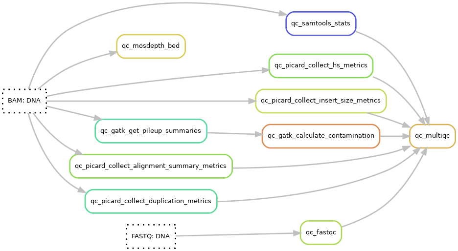

# QC
See the [qc hydra-genetics module](https://hydra-genetics-qc.readthedocs.io/en/latest/) documentation for more details on the softwares for the quality control. Default hydra-genetics settings/resources are used if no configuration is specified.

<br />
{: style="height:55%;width:55%"}

## Pipeline output files:

* `results/dna/qc/multiqc_DNA.html`
* `results/dna/{sample}_{type}/qc/{sample}_{type}.coverage_and_mutations.tsv`
* `gvcf_dna/{sample}_{type}.mosdepth.g.vcf.gz`

## MultiQC
A MultiQC html report is generated using **[MultiQC](https://github.com/ewels/MultiQC)** v1.11. The report starts with a general statistics table showing the most important QC-values followed by additional QC data and diagrams. The qc data is generated using FastQC, samtools, picard, and GATK.

### Configuration
**Software settings**

* `multiqc: reports: DNA: config`: Config of the general statistics table
* `qc_files`: Configuration of input files to MultiQC in the config file:

```yaml
# config.yaml
multiqc:
  container: "docker://hydragenetics/multiqc:1.11"
  reports:
    DNA:
      config: "config/multiqc_config_dna.yaml"
      included_unit_types: ["N", "T"]
      qc_files:
        - "qc/fastqc/{sample}_{type}_{flowcell}_{lane}_{barcode}_fastq1_fastqc.zip"
        - "qc/fastqc/{sample}_{type}_{flowcell}_{lane}_{barcode}_fastq2_fastqc.zip"
        - "qc/picard_collect_alignment_summary_metrics/{sample}_{type}.alignment_summary_metrics.txt"
        - "qc/picard_collect_duplication_metrics/{sample}_{type}.duplication_metrics.txt"
        - "qc/picard_collect_hs_metrics/{sample}_{type}.HsMetrics.txt"
        - "qc/picard_collect_insert_size_metrics/{sample}_{type}.insert_size_metrics.txt"
        - "qc/samtools_stats/{sample}_{type}.samtools-stats.txt"
        - "qc/gatk_calculate_contamination/{sample}_{type}.contamination.table"
```

## FastQC
**[FastQC](https://www.bioinformatics.babraham.ac.uk/projects/fastqc/)** v0.11.9 is run on the raw fastq-files.

### Configuration
**Cluster resources**

| **Options** | **Value** |
|-------------|-|
| mem_mb | 12288 |
| mem_per_cpu | 6144 |
| threads | 2 |

## Samtools
**[Samtools stats](http://www.htslib.org/doc/samtools-stats.html)** v1.15 is run on BWA-mem aligned and merged bam files.

## Picard
**[Picard](https://broadinstitute.github.io/picard/)** v2.25.0 is run on BWA-mem aligned and merged bam files collecting a number of metrics. The metrics calculated are listed below:

* **picard CollectAlignmentSummaryMetrics** - using a [fasta reference genome](references.md#reference_fasta) file
* **picard CollectDuplicationMetrics**
* **picard CollectHsMetrics** - using a fasta [fasta reference genome](references.md#reference_fasta) file, a [design bed](references.md#design_bed) file, and with the option COVERAGE_CAP=5000
* **picard CollectInsertSizeMetrics**

## GATK
Cross-sample contamination is estimated using **[GATK](https://gatk.broadinstitute.org/hc/en-us)** v4.1.9.0. The contamination is calculated by **gatk GetPileupSummaries** making pileups for input SNP positions on BWA-mem aligned and merged bam files followed by evaluating these pileups with **gatk CalculateContamination**. Contamination levels should very low so that already at 1% there is reason to be concerned.

## Genome vcf
Using **[GATK Mutect2](https://gatk.broadinstitute.org/hc/en-us/articles/360037593851-Mutect2)** v4.1.9.0 it is possible to make a vcf with alternative allele information for all positions in the design bed. As in the ordinary variant calling the individual chromosome bamfiles are used and then the vcf-files are merged. Additionally, the coverage of all positions are calculated using **[mosdepth](https://github.com/brentp/mosdepth)** v0.3.2 and then added to the final vcf file.

### Configuration
**References**

* [fasta reference genome](references.md#reference_fasta)
* [design bed](references.md#design_bed) region file (split by bed_split rule into chromosome chunks)

<br />
**Cluster resources for Mutect2**

| **Options** | **Value** |
|-------------|-|
| mem_mb | 12288 |
| mem_per_cpu | 6144 |
| time | "48:00:00" |

### Result file

* `gvcf_dna/{sample}_{type}.mosdepth.g.vcf.gz`

## Coverage and mutations
This excel-friendly report produced by the in-house script [hotspot_report.py](https://github.com/genomic-medicine-sweden/Twist_Solid/blob/develop/workflow/scripts/hotspot_report.py) ([rule and configuration](softwares.md#hotspot_report)) contains coverage in all clinical relevant positions defined in a "hotspot"-file and flags positions with low coverage. It also collects information on the filtered variants from the vcf file. The coverage flag is configured by the levels option, included columns are configured in `hotspot_report.yaml` and chromosome id translation is done by `hotspot_report.chr.translation.hg19`.

### Configuration
**References**

* [File](references.md#hotspot_report) with clinical relevant positions

<br />
**Software settings**
```yaml
report_config: "config/hotspot_report.yaml"
chr_translation_file: "config/hotspot_report.chr.translation.hg19"
levels:
  - [200, "ok", "yes"]
  - [30, "low", "yes"]
  - [0, "low", "not analyzable"]
```

### Result file

* `results/dna/{sample}_{type}/qc/{sample}_{type}.coverage_and_mutations.tsv`

<br />
