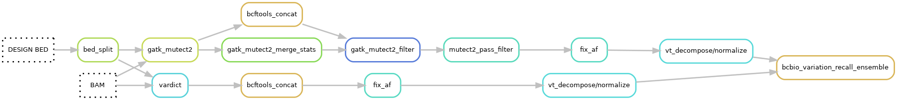

# SNV and INDEL calling, annotation and filtering
See the [snv_indels hydra-genetics module](https://hydra-genetics-snv-indels.readthedocs.io/en/latest/) documentation for more details on the softwares for variant calling, [annotation hydra-genetics module](https://hydra-genetics-annotation.readthedocs.io/en/latest/) for annotation and [filtering hydra-genetics module](https://hydra-genetics-filtering.readthedocs.io/en/latest/) for filtering. Default hydra-genetics settings/resources are used if no configuration is specified.

 

## Pipeline output files:

* `results/dna/{sample}_{type}/vcf/{sample}_{type}.annotated.exon_only.filter.hard_filter.codon_snv.vcf`
* `results/dna/{sample}_{type}/vcf/{sample}_{type}.annotated.exon_only.filter.hard_filter.codon_snv.qci.vcf`
* `bam_dna/mutect2_indel_bam/{sample}_{type}.bam`

## SNV and INDEL calling
Small variants are called with **[GATK Mutect2](https://gatk.broadinstitute.org/hc/en-us/articles/360037593851-Mutect2)** v4.1.9.0 and **[Vardict](https://github.com/AstraZeneca-NGS/VarDict)** v1.8.3.

### GATK Mutect2 variant calling
SNVs and INDELs are called by Mutect2 on individual chromosome bamfiles.

### Configuration

**Reference files**

* [reference fasta](references.md#reference_fasta) genome
* [design bed](references.md#design_bed) region file (split by bed_split rule into chromosome chunks)

 
**Cluster resources**

| **Options** | **Value** |
|-------------|-|
| time | "48:00:00" |

### GATK Mutect2 merging
The stats file from GATK Mutect2 calling are merged with **[GATK MergeMutectStats](https://gatk.broadinstitute.org/hc/en-us/articles/360035531132--How-to-Call-somatic-mutations-using-GATK4-Mutect2)** v4.1.9.0 and the vcf files are merged with **[bcftools concat](https://samtools.github.io/bcftools/bcftools.html#concat)** v1.15.

### GATK Mutect2 vcf soft filtering
Merged Mutect2 vcf files are softfiltered with **[GATK FilterMutectCalls](https://gatk.broadinstitute.org/hc/en-us/articles/360035531132--How-to-Call-somatic-mutations-using-GATK4-Mutect2)** v4.1.9.0, which puts filter flags in the vcf FILTER column.

### GATK Mutect2 vcf hard filtering
Hardfilter Mutect2 vcf files based on the FILTER flags using the in-house script [mutect_pass_filter.py](https://github.com/hydra-genetics/snv_indels/blob/develop/workflow/scripts/mutect2_pass_filter.py) ([rule](https://github.com/hydra-genetics/snv_indels/blob/develop/workflow/rules/mutect2_pass_filter.smk)). and will only keep variants flagged as:

* PASS
* multiallelic

### Vardict variant calling
SNVs and INDELs are called by **[Vardict](https://github.com/AstraZeneca-NGS/VarDict)** on individual chromosome bamfiles.

### Configuration
**References**

* [reference fasta](references.md#reference_fasta) genome
* [design bed](references.md#design_bed) region file (split by bed_split rule into chromosome chunks)

 
**Software settings**

| **Options** | **Value** | **Description** |
|-------------|-|-|
| bed_columns | -c 1 -S 2 -E 3 -g 4 | bed column definitions |
| extra | -Q 1 | remove reads with 0 mapping quality |
| allele_frequency_threshold | 0.01 | minimal reported allele frequency |

 
**Cluster resources**

| **Options** | **Value** |
|-------------|-|
| time | "48:00:00" |

### Vardict vcf merging
The Vardict vcf files from individual chromosomes are merged with **[bcftools concat](https://samtools.github.io/bcftools/bcftools.html#concat)** v1.15.

## Variant vcf decomposition and normalization
Variants called by Vardict and Mutect2 are decomposed by **[vt decompose](https://genome.sph.umich.edu/wiki/Vt#Decompose)** follwed by **[vt decompose_blocksub](https://genome.sph.umich.edu/wiki/Vt#Decompose_biallelic_block_substitutions)** v2015.11.10. The vcf files are then normalized by **[vt normalize](https://genome.sph.umich.edu/wiki/Vt#Normalization)** v2015.11.10.

## Variant ensemble
Variant vcf files from the two callers are ensembled into one vcf file using **[bcbio-variation-recall ensemble](https://github.com/bcbio/bcbio.variation.recall)** v0.2.6. All variants from both caller are retained. When both callers call the same variant the INFO and FORMAT data is taken from the Vardict vcf file.

### Configuration

**Software settings**

| **Options** | **Value** | **Description** |
|-------------|-|-|
| support | -n 1 | keep all variant call by at least one caller |
| sort_order | --names vardict, gatk_mutect2 | priority order for retaining variant information |

## Annotation
The ensembled vcf file is annotated firstly using VEP, followed by artifact annotation and background annotation. See the [annotation hydra-genetics module](https://hydra-genetics-annotation.readthedocs.io/en/latest/) for additional information.

### VEP
The ensembled vcf file is annotated using **[VEP](https://www.ensembl.org/info/docs/tools/vep/index.html)** v105. VEP adds a pletora of information for each variant which is specified by the configuration flags listed below. Of note are --pick which picks only one representative transcript for each variant, --af_gnomad which adds germline information, and --cache which uses a local copy of the databases for better performance. See [VEP options](https://www.ensembl.org/info/docs/tools/vep/script/vep_options.html) for more information.

#### Configuration

**References**

* [VEP cache](references.md#vep_cache) including all databases adapted for reference genome GRCh37 and VEP version 105
* [Fasta reference](references.md#reference_fasta) genome

 
**Software settings**

| **Options** | **Value** |
|-------------|-|
| vep_cache | path_to_vep_cache |
| mode | --offline --cache |
| extra | --assembly GRCh37 --check_existing --pick --sift b --polyphen b --ccds --uniprot --hgvs --symbol --numbers --domains --regulatory --canonical --protein --biotype --uniprot --tsl --appris --gene_phenotype --af --af_1kg --af_gnomad --max_af --pubmed --variant_class |

 
**Resources**

| **Options** | **Value** |
|-------------|-|
| mem_mb | 30720 |
| mem_per_cpu | 6144 |
| threads | 5 |
| time | "6:00:00" |

### Artifact annotation
Identifying artifacts is crucial in a Tumor-only FFPE pipeline such as the GMS560 Twist Solid pipeline. The artifact annotation is performed using the in-house script [artifact_annotation.py](https://github.com/hydra-genetics/annotation/blob/develop/workflow/scripts/artifact_annotation.py) ([rule](https://github.com/hydra-genetics/annotation/blob/develop/workflow/rules/artifact_annotation.smk)). The annotation is based on variants called in a number of normal FFPE samples sequenced using the same panel and on the same sequencing machine type as the analysed tumor samples. See [references](references.md) for more information on how the Panel of Normal was created.  

Example annotation for one variant added to a vcf file in the INFO field:  

| **Field** | **Value** | **Description** |
|----------|-|-|
| Artifact | 12,35,36 | Nr of calls made in the PoN using Vardict, Mutect2, and total of samples in the PoN |
| ArtifactMedian | 0.29,0.25 | Median MAF of the calls |
| ArtifactNrSD | 0.58,0.56 | Number of standard deviation between the median allele frequency in the PoN and the call in the variant |

#### Configuration

**References**

* [Panel of Normal](references.md#artifact_db) with position specific artifact information for each caller and variant type

### Hotspot annotation
Annotate clinically important variants in the vcf file using the in-house script [add_hotspot_annotation.py](https://github.com/hydra-genetics/annotation/blob/develop/workflow/scripts/add_hotspot_information.py) ([rule](https://github.com/hydra-genetics/annotation/blob/develop/workflow/rules/hotspot_annotation.smk)) and a hotspot list.

#### Configuration

**Reference**

* [Hotspot positions file](references.md#hotspot_file)

### Background SNV annotation
In positions with high background noise it can be hard to distinguish low MAF variants. The background level for all SNVs is therefor added in the vcf file. The background annotation is performed using the in-house script [background_annotation.py](https://github.com/hydra-genetics/annotation/blob/develop/workflow/scripts/background_annotation.py) ([rule](https://github.com/hydra-genetics/annotation/blob/develop/workflow/rules/background_annotation.smk)). It is based on a panel of normal with position specific alternative alleles frequencies obtained from genome VCF files created by **[GATK Mutect2](https://gatk.broadinstitute.org/hc/en-us/articles/360037593851-Mutect2)** v4.1.9.0. See [references](references.md) for more information on how the Panel of Normal was created.  

Example annotation for one variant added to a vcf file in the INFO field:

| **Field** | **Value** | **Description** |
|----------|-|-|
| PanelMedian | 1.0013 | Median fraction of alternative alleles |
| PositionNrSD | 12.17 | Number of standard deviation between the Median fraction in the PoN and allele frequency of the call in the variant |

#### Configuration

**References**

* [Panel of Normal](references.md#background_db) with position specific background information

## Filtering
Annotated vcfs are hard filtered first by removing regions outside exons and then filtered by a number of filtering criteria described below. See the [filtering hydra-genetics module](https://hydra-genetics-filtering.readthedocs.io/en/latest/) for additional information. A soft filtered version of the exonic regions is also provided for development and other investigations.

### Extract exonic regions
Use **[bcftools filter -R](https://samtools.github.io/bcftools/bcftools.html)** v1.15 to extract variants overlapping exonic regions (including 20 bp padding) defined in a bed file which is a sub bed file of the general design bed file.  

 
#### Configuration

**References**

* [Bed file](references.md#bcftools_filter) with exonic regions including 20 bp padding

### Hard filter vcf
The exonic vcf files are filtered using the **hydra-genetics filtering** functionality included in v0.15.0. The filters are specified in the config file `config_hard_filter_uppsala.yaml` and consists of the following filters:

#### Configuration

**Software settings**

| **Filter** | **Description** |
|-------------|-|
| intron | Filter intronic variants with the following exceptions; splice variant, in genes MET or TERT, or in the COSMIC database |
| low vaf | Filter variants with variant allele frequency below 1% |
| artifacts | Filter variants found in more than 3 normal samples except if the allele frequency is more than 5 standard deviations above the median allele frequency found in the normals |
| background | Filter SNV variants where the positions background median noise plus 4 standard deviations is higher than the variant allele frequency except for variants in hotspots |
| germline | Filter germline variants when the GnomAD global population allele frequency is above 0.5% |
| variant observations | Filter variants with fewer than 20 supporting reads except for variants in hotsports and in the TERT gene which only need 10 and 4 supporting reads respectively |

## Combine SNVs in the same codon
Two or more variants affecting the same codon can have different clinical implications when considered individually compared to in combination. This is because the combined variant could end up coding for a different amino acid then the when only looking at the variant individually. Variants within the same codon are therefore combined and added to the vcf file using the in-house script [add_multi_snv_in_codon.py](https://github.com/hydra-genetics/annotation/blob/develop/workflow/scripts/add_multi_snv_in_codon.py) ([rule](https://github.com/hydra-genetics/annotation/blob/develop/workflow/rules/add_multi_snv_in_codon.smk)). Codon information is based on the VEP annotation. Annotation information is taken from the variant with the highest allele frequency. After adding the combined variants the vcf is sorted and annotated again.

### Configuration

**Software settings**

| **Options** | **Value** | **Description** |
|-------------|-|-|
| af_limit | 0.00 | No lower limit for allele frequency |
| artifact_limit | 10000 | Allow any number of observations (10000) in the PoN as they are already filtered |

### Result file

* `results/dna/{sample}_{type}/vcf/{sample}_{type}.annotated.exon_only.filter.hard_filter.codon_snv.vcf`

## QCI AF correction of vcf
The clinical interpretation tool QCI calculates allele frequency from the AD FORMAT field instead of using the AF FORMAT field supplied by the callers. This has shown to be wrong especially for INDELs. The AD field is therefore corrected so that the allele frequency based on the AD field corresponds to the AF field. This correction of the vcf file is performed by an the in-house script [fix_vcf_ad_for_qci.py](https://github.com/genomic-medicine-sweden/Twist_Solid/blob/develop/workflow/scripts/fix_vcf_ad_for_qci.py) ([rule and config](softwares.md#fix_vcf_ad_for_qci)).

### Result file

* `results/dna/{sample}_{type}/vcf/{sample}_{type}.annotated.exon_only.filter.hard_filter.codon_snv.qci.vcf`

## GATK Mutect2 variant bam file
When **[GATK Mutect2](https://gatk.broadinstitute.org/hc/en-us/articles/360037593851-Mutect2)** finds INDEL candidates it realignes reads in this regions and outputs a realigned bam-file covering these INDEL regions. This makes it possible to inspect INDELs called by Mutect2 in [IGV](https://software.broadinstitute.org/software/igv/). As Mutect2 runs on individual chromosomes these bam-files are then merged, sorted and indexed before.

### Result file

`bam_dna/mutect2_indel_bam/{sample}_{type}.bam`

 
