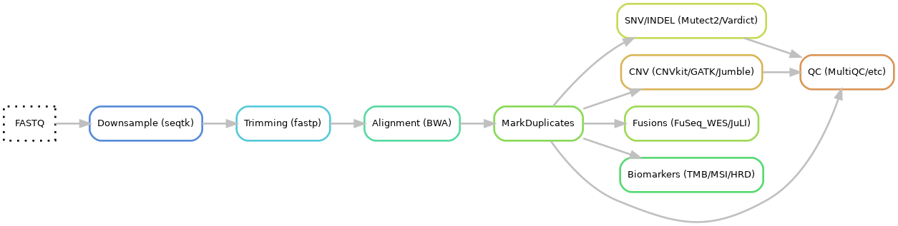
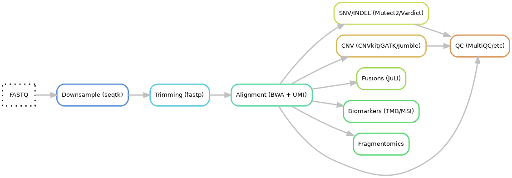
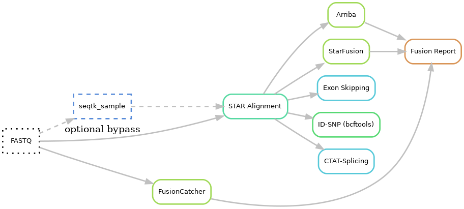

# Overview of the pipeline
Here is a brief overview of the entire pipeline. For details see subsections and the [hydra-genetics](https://github.com/hydra-genetics/hydra-genetics) documentation.

## DNA (FFPE)
{: style="height:50%;width:50%"}
1. **Input files**: fastq
2. **Downsample**: seqtk
3. **Trimming** using fastp
4. **Alignment** using BWA-mem
5. **Mark duplicates** using Picard
6. **SNV and INDEL**  
  6.1 Calling using Mutect2 and Vardict  
  6.2 Annotation using VEP and hydra-genetics annotation module
  6.3 Filtering using bcftools and hydra-genetics filtering module
7. **CNV**  
  7.1 Calling using CNVkit, GATK CNV and Jumble
  7.2 Merging using SVDB
  7.3 Annotation using SVDB and hydra-genetics  
  7.4 Filtering using hydra-genetics  
  7.5 CNV html report using hydra-genetics filtering module
8. **Fusion** calling using FuSeq_WES and JuLI
9. **Biomarkers**  
  9.1 TMB using hydra-genetics biomarker module
  9.2 MSI score using MSIsensor-Pro  
  9.3 HRD using CNVkit and ScarHRD  
10. **QC**  
  10.1 QC measures from Samtools, Picard, FastQC, GATK  
  10.2 MultiQC hmtl report  
  10.3 Hotspot coverage report  
  10.4 Sample mixup check

## DNA (ctDNA)
{: style="height:50%;width:50%"}
1. **Input files**: fastq
2. **Downsample**: seqtk
3. **Trimming** using fastp
4. **Alignment** using BWA-mem and UMI consensus calling
5. **SNV and INDEL**  
  5.1 Calling using Mutect2 and Vardict  
  5.2 Annotation using VEP and hydra-genetics annotation module
  5.3 Filtering using bcftools and hydra-genetics filtering module
6. **CNV**  
  6.1 Calling using CNVkit, GATK CNV and Jumble
  6.2 Merging using SVDB
  6.3 Annotation using SVDB and hydra-genetics  
  6.4 Filtering using hydra-genetics  
  6.5 CNV html report using hydra-genetics filtering module
7. **Fusion** calling using JuLI
8. **Biomarkers**  
  8.1 TMB using hydra-genetics biomarker module
  8.2 MSI score using MSIsensor-Pro
9. **Fragmentomics** using FinaleToolkit
10. **QC**  
  10.1 QC measures from Samtools, Picard, FastQC, GATK  
  10.2 MultiQC hmtl report  
  10.3 Hotspot coverage report  

## RNA
{: style="height:50%;width:50%"}
1. **Input files**: fastq
2. **Downsample**: seqtk
3. **Alignment** using Star
4. **Fusions**  
  4.1 Fusion calling using Arriba, StarFusion, FusionCatcher  
  4.2 Filtering and report using in-house script  
  4.3 Fusion images using Arriba  
5. **Exon skipping** using in-house script and ctat-splicing
6. **ID-SNP** calling using bcftools
7. **QC**  
  7.1 QC measures from Samtools, Picard, FastQC, Mosdepth  
  7.2 MultiQC hmtl report  
  7.3 House keeping gene coverage  
  7.4 Sample mixup check

   
